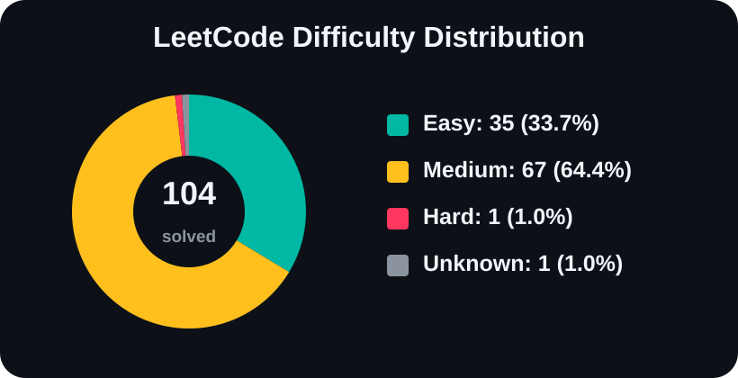

# LeetCode Solutions

Collection of solved LeetCode problems in Python.

<!-- LEETCODE_STATS_START -->

**Total solved:** 41

| Difficulty | Count |
|---|---:|
| Easy | 12 |
| Medium | 27 |
| Hard | 0 |

**Problems without difficulty lookup:**

- `combination_sum_2`
- `subsets_2`
<!-- LEETCODE_STATS_END -->
